# TomGhost Resolução


## Enumeração de portas
Vamos começar com o NMAP:

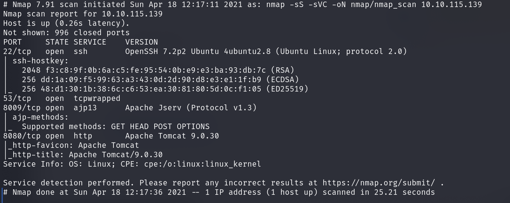

Se procurarmos exploit das verções do Apache eventualmente encontraremos uma CVE "Ghostcat" para o Apache Jserv
>CVE-2020-1938

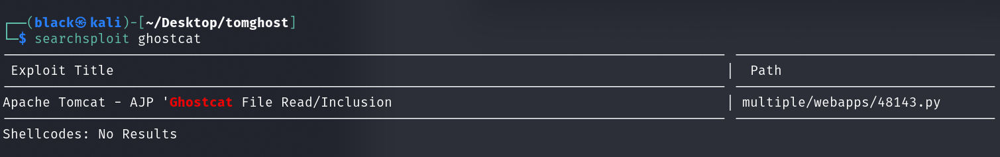

Vamos testar...

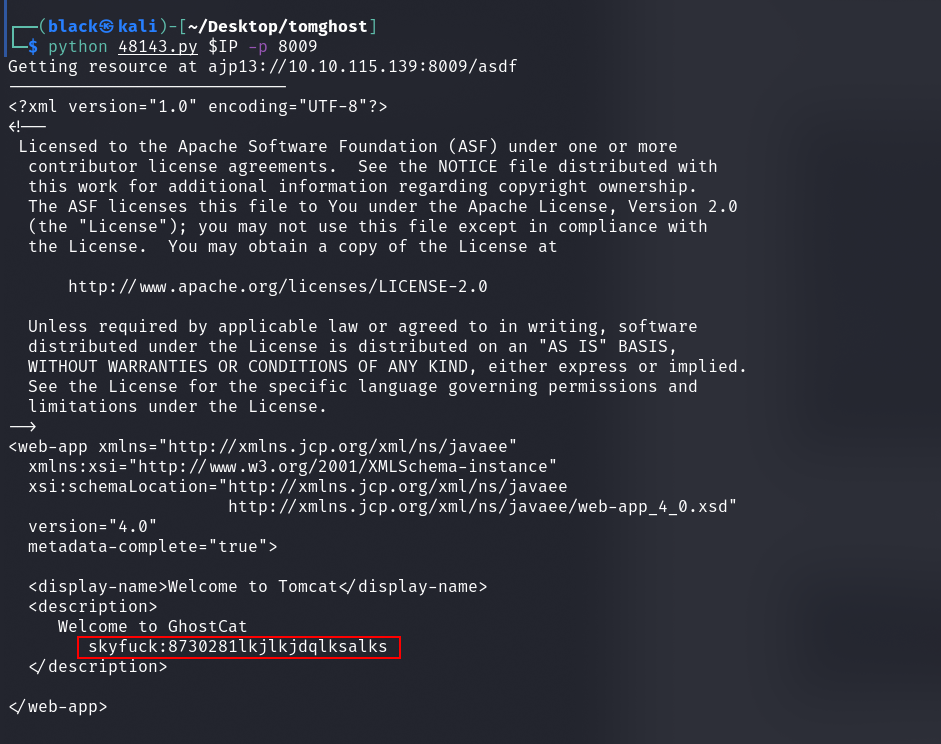

Recebemos algo de volta, se analisarmos parece ter uma credencial SSH.

>Conseguimos fazer o login com as credenciais encontradas.
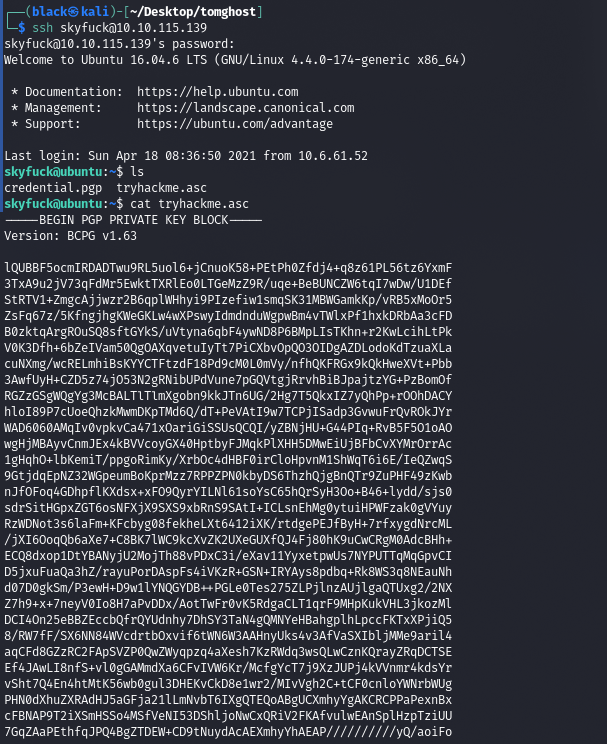

Encontramos dois arquivos no diretório de "skyfuck", uma mensagem criptografado, e uma chave PGP para descriptografar a mensagem, porém a chave esta protegida por uma senha, vamos quebrá-la. <p>
>Para quebrá-la, primeiro temos que prepara uma hash para o john, para isso vamos utilizar gpg2john

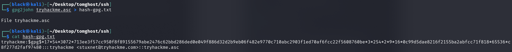

Conseguimos quebrar a senha facilmente com a "rockyou.txt"

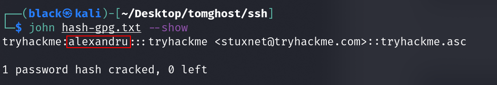
 
 Agora sim podemos ler a mensagem:
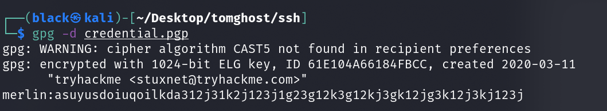
>Parece que temos uma nova credencial SSH, vamos logar.

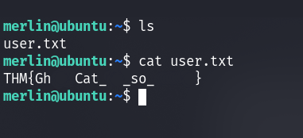

Conseguimos logar como "merlin" e assim conseguimos nossa primeira flag.
Ao executarmos o comando ```sudo -l``` vemos que o usuário "merlin" pode executar o zip como root:
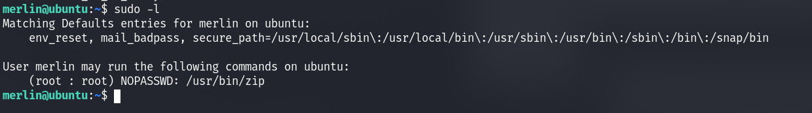

Ao olharmos nosso querido [GFTO](https://gtfobins.github.io/gtfobins/zip/) encontramos uma maneira de elevar nosso privilégio para root de forma bem fácil:
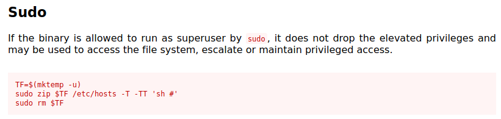

Por fim temos uma shell como root e nossa última flag
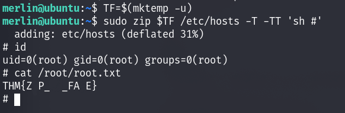